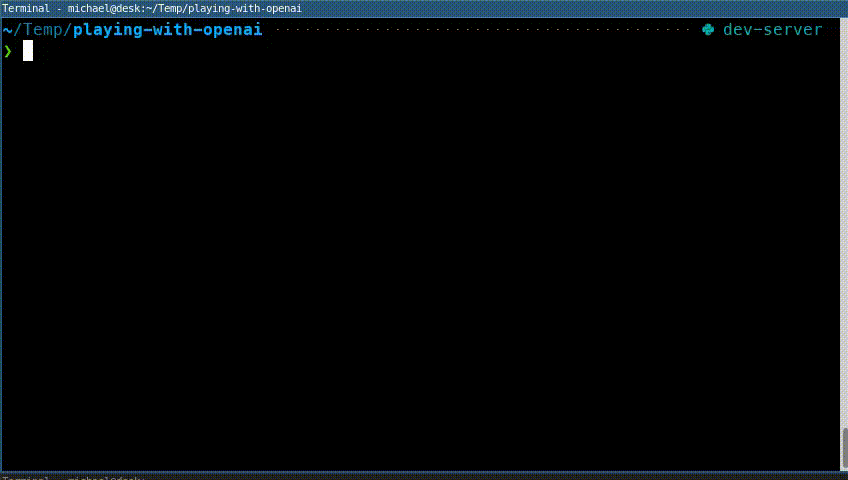

A ChatGPT command-line tool for fixing errors in your source code

# Installation

## Prerequisites

You need Python 3 and an
[OpenAPI API key](https://platform.openai.com/account/api-keys).

## Linux and macOS

1. Download the [source code](https://github.com/mherrmann/fix/archive/refs/heads/main.zip).
2. Unpack it. We'll assume you unpacked to `~/Downloads/fix-main`.
3. Open a command prompt and change to that directory: `cd ~/Downloads/fix-main`.
4. Create a virtual environment with `pipenv install`
5. Create an alias for the command: `alias fix='~/Downloads/fix-main/fix'`.

## Windows

1. Download the [source code](https://github.com/mherrmann/fix/archive/refs/heads/main.zip).
2. Unpack it. We'll assume you unpacked to `C:\Users\<user>\Downloads\fix-main`.
3. Open a command prompt and change to that directory: `cd C:\Users\<user>\Downloads\fix-main`.
3. Create a Python 3 virtual environment in that directory: `python3 -m venv venv`.
4. Activate the virtual environment: `call venv\Scripts\activate`.
5. Install dependencies: `pip install -Ur requirements.txt`
6. Create an alias for the command: `doskey fix=C:\Users\<user>\Downloads\fix-main\venv\Scripts\python C:\Users\<user>\Downloads\fix-main\main.py`.

# Caveats

The [implementation](main.py) may send files from your system that are mentioned
in command outputs to OpenAI's servers. What could possibly go wrong?
